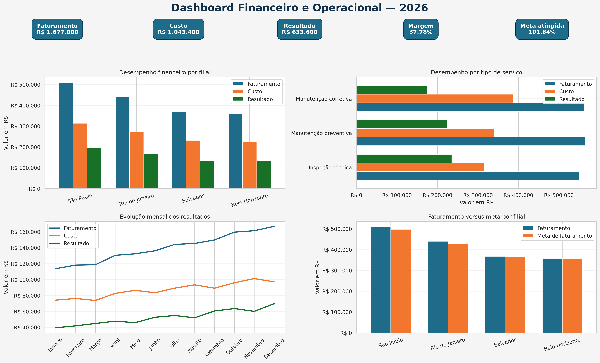
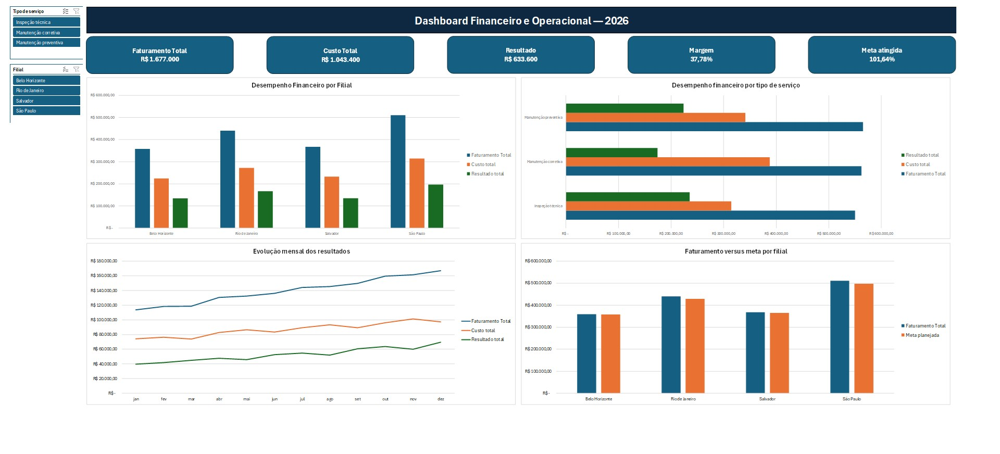

# Dashboard Financeiro e Operacional

Projeto de análise financeira e operacional desenvolvido com Python e Excel, utilizando dados fictícios de uma empresa prestadora de serviços.

O trabalho contempla preparação dos dados, cálculo de indicadores, análises por filial, evolução mensal, rentabilidade por serviço e comparação entre faturamento realizado e meta planejada.

## Dashboard desenvolvido em Python



## Principais indicadores

- **Faturamento total:** R$ 1.677.000,00
- **Custo total:** R$ 1.043.400,00
- **Resultado acumulado:** R$ 633.600,00
- **Margem consolidada:** 37,78%
- **Atingimento da meta:** 101,64%
- **Quantidade de serviços:** 584

## Objetivos

- Analisar faturamento, custos e resultados;
- Comparar o desempenho financeiro das filiais;
- Avaliar a evolução mensal;
- Identificar os serviços com maior rentabilidade;
- Comparar faturamento realizado e meta;
- Desenvolver dashboards gerenciais em Python e Excel.

## Principais conclusões

- São Paulo apresentou o maior faturamento e resultado acumulado;
- A inspeção técnica apresentou a maior margem percentual;
- A manutenção corretiva apresentou a menor margem;
- O faturamento total superou a meta planejada em 1,64%;
- Todas as filiais atingiram suas respectivas metas;
- O faturamento apresentou tendência de crescimento durante 2026.

## Dashboard desenvolvido no Excel



## Tecnologias utilizadas

- Python
- Pandas
- Matplotlib
- Seaborn
- Google Colab
- Microsoft Excel
- Tabelas e gráficos dinâmicos

## Arquivos do projeto

```text
analise_financeira_operacional.ipynb
base_financeira.csv
dashboard_financeiro_python.png
dashboard_financeiro_operacional.xlsx
dashboard_excel.jpg
```

## Como executar

1. Baixe o notebook e o arquivo `base_financeira.csv`;
2. Abra `analise_financeira_operacional.ipynb` no Google Colab;
3. Execute as células na ordem apresentada;
4. Quando solicitado, selecione o arquivo `base_financeira.csv`.

## Observação

Todos os dados utilizados são fictícios e destinados exclusivamente a fins educacionais e de portfólio.

## Autora

**Camile Ribeiro Silva**

Engenheira Aeronáutica com experiência em Controladoria Operacional e interesse em Análise de Dados, Business Intelligence e Finanças.
